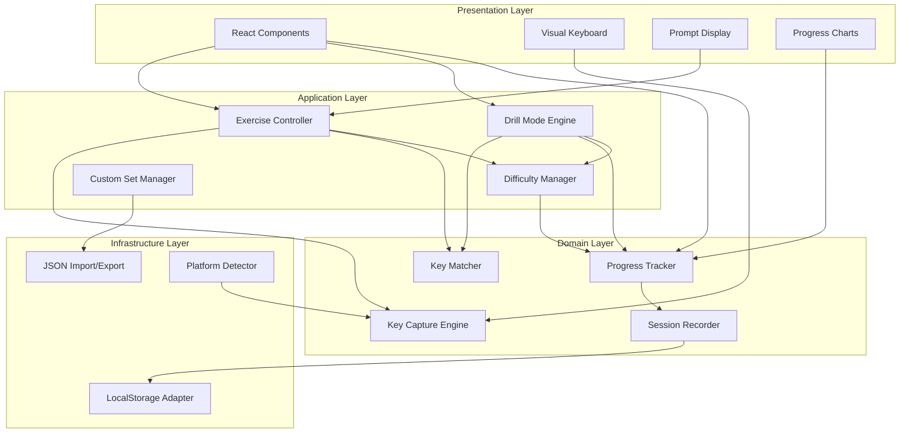
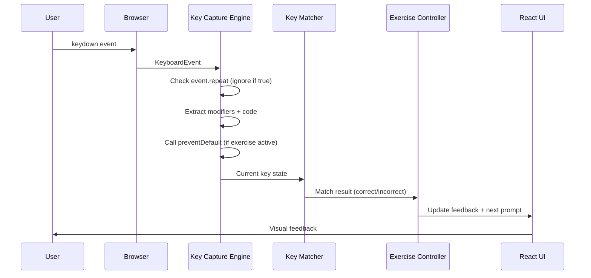
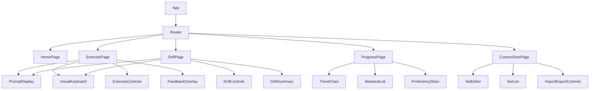

# Design Document: Modifier Key Trainer

## Overview

The Modifier Key Trainer is a client-side web application built with TypeScript and React that teaches users to efficiently press modifier keys, number keys, function keys, and multi-key combinations on macOS. The application captures raw keyboard events via the browser's KeyboardEvent API, uses `preventDefault` to intercept browser shortcuts during active exercises, and provides adaptive drill-mode training with progress tracking persisted in localStorage.

### Key Design Decisions

1. **Single-page React application** — No server required; all state lives in memory and localStorage. This simplifies deployment (static hosting) and eliminates network latency from the training loop.
2. **TypeScript** — Strong typing for key codes, modifier state, and event handling reduces bugs in the input layer where precision is critical.
3. **Vite as build tool** — Fast HMR during development and optimized production builds for a static site.
4. **No external UI framework** — TailwindCSS for styling. The app is interaction-heavy but visually straightforward; a component library would add weight without proportional benefit.
5. **Chart.js for progress visualization** — Lightweight, canvas-based charting for the progress line charts.

### Tech Stack

| Layer | Choice | Rationale |
|-------|--------|-----------|
| Language | TypeScript 5.x | Type safety for key event handling |
| UI Framework | React 18 | Component model, hooks for state/effects |
| Styling | TailwindCSS 3 | Utility-first, no runtime CSS-in-JS |
| Build | Vite 5 | Fast dev server, optimized builds |
| Charts | Chart.js + react-chartjs-2 | Lightweight progress visualization |
| Testing | Vitest + fast-check | Unit/property tests in same ecosystem |
| Storage | localStorage | No backend, zero setup for users |

---

## Architecture

The application follows a layered architecture with clear separation between input handling, exercise logic, and presentation.



### Data Flow



---

## Components and Interfaces

### Key Capture Engine

Responsible for intercepting keyboard events and translating them into a normalized key state representation.

```typescript
interface KeyState {
  modifiers: {
    ctrlLeft: boolean;
    ctrlRight: boolean;
    altLeft: boolean;
    altRight: boolean;
    shiftLeft: boolean;
    shiftRight: boolean;
    metaLeft: boolean;
    metaRight: boolean;
  };
  baseKey: string | null; // event.code for non-modifier key, null if only modifiers held
}

interface KeyCaptureEngine {
  /** Start capturing key events, calling preventDefault during exercises */
  enable(exerciseActive: boolean): void;
  /** Stop capturing key events */
  disable(): void;
  /** Subscribe to complete key combination events */
  onKeyCombination(callback: (state: KeyState) => void): () => void;
  /** Get current held keys (for visual keyboard) */
  getCurrentState(): KeyState;
}
```

### Key Matcher

Compares captured key state against the expected combination for the current prompt.

```typescript
interface KeyCombination {
  modifiers: ModifierSet;
  baseKey: string; // event.code value (e.g., "KeyC", "Digit1", "F5")
}

interface ModifierSet {
  ctrl: boolean;
  alt: boolean;
  shift: boolean;
  meta: boolean;
}

interface MatchResult {
  correct: boolean;
  expected: KeyCombination;
  actual: KeyState;
  timestamp: number;
}

interface KeyMatcher {
  match(expected: KeyCombination, actual: KeyState): MatchResult;
}
```

### Exercise Controller

Manages the sequence of prompts within an exercise, tracks timing, and coordinates feedback.

```typescript
interface ExerciseConfig {
  category: KeyCategory;
  promptCount: number; // 10-50
  prompts: KeyCombination[];
}

interface ExerciseState {
  currentPromptIndex: number;
  totalPrompts: number;
  currentPrompt: KeyCombination;
  results: PromptResult[];
  startTime: number;
  status: 'idle' | 'active' | 'complete';
}

interface PromptResult {
  prompt: KeyCombination;
  attempts: number;
  responseTimeMs: number;
  correct: boolean;
}

interface ExerciseController {
  start(config: ExerciseConfig): void;
  handleInput(state: KeyState): void;
  getState(): ExerciseState;
  onStateChange(callback: (state: ExerciseState) => void): () => void;
}
```

### Drill Mode Engine

Extends exercise logic with adaptive prompt selection based on user performance.

```typescript
interface DrillConfig {
  category: KeyCategory;
  customSet?: KeyCombination[];
}

interface DrillStats {
  accuracy: number;
  avgResponseTimeMs: number;
  mostMissed: KeyCombination[]; // up to 3
  totalAttempts: number;
}

interface DrillModeEngine {
  start(config: DrillConfig): void;
  stop(): DrillStats;
  handleInput(state: KeyState): void;
  getWeightedNextPrompt(): KeyCombination;
  onEscapeSequence(callback: () => void): () => void;
}
```

### Difficulty Manager

Tracks level progression per category and determines which prompts are available.

```typescript
type DifficultyLevel = 1 | 2 | 3 | 4;

interface LevelCriteria {
  minAccuracy: number;    // 0.9
  maxResponseTimeMs: number; // 1000
  minAttempts: number;    // 20
}

interface CategoryProgress {
  currentLevel: DifficultyLevel;
  unlockedLevels: DifficultyLevel[];
  manualOverride: boolean;
  levelStats: Record<DifficultyLevel, { accuracy: number; avgResponseTimeMs: number; attempts: number }>;
}

interface DifficultyManager {
  getAvailableLevels(category: KeyCategory): DifficultyLevel[];
  checkProgression(category: KeyCategory, stats: LevelStats): boolean;
  unlockLevel(category: KeyCategory, level: DifficultyLevel): void;
  overrideAll(category: KeyCategory): void;
  getPromptsForLevel(category: KeyCategory, level: DifficultyLevel): KeyCombination[];
}
```

### Progress Tracker

Persists and retrieves session history for statistics and trend visualization.

```typescript
interface SessionRecord {
  id: string;
  date: string; // ISO 8601
  category: KeyCategory;
  accuracy: number;
  avgResponseTimeMs: number;
  promptCount: number;
  perCombinationData: CombinationStat[];
}

interface CombinationStat {
  combination: KeyCombination;
  attempts: number;
  correctCount: number;
  avgResponseTimeMs: number;
}

interface ProgressTracker {
  saveSession(record: SessionRecord): boolean;
  getSessions(category?: KeyCategory, days?: number): SessionRecord[];
  getWeakestCombinations(limit: number): CombinationStat[];
  getProficiencyRating(category: KeyCategory): number | null; // 1-5 or null if <5 sessions
  isStorageAvailable(): boolean;
}
```

### Custom Set Manager

Handles CRUD operations for user-defined training sets and JSON import/export.

```typescript
interface CustomTrainingSet {
  id: string;
  name: string; // 1-50 chars, trimmed
  combinations: KeyCombination[];
  createdAt: string;
  updatedAt: string;
}

interface CustomSetManager {
  create(name: string, combinations: KeyCombination[]): CustomTrainingSet;
  update(id: string, changes: Partial<Pick<CustomTrainingSet, 'name' | 'combinations'>>): CustomTrainingSet;
  delete(id: string): void;
  getAll(): CustomTrainingSet[];
  getById(id: string): CustomTrainingSet | null;
  exportToJSON(id: string): string;
  importFromJSON(json: string): CustomTrainingSet;
  getPresets(): CustomTrainingSet[];
}
```

### Platform Detector

Identifies the user's OS to provide appropriate warnings for non-macOS platforms.

```typescript
interface PlatformInfo {
  isMacOS: boolean;
  userAgent: string;
}

interface PlatformDetector {
  detect(): PlatformInfo;
}
```

### React Component Tree



---

## Data Models

### LocalStorage Schema

All data is stored under a namespaced key prefix `mkt_` (modifier key trainer).

```typescript
// Key: mkt_sessions
type StoredSessions = SessionRecord[];

// Key: mkt_custom_sets
type StoredCustomSets = CustomTrainingSet[];

// Key: mkt_category_progress
type StoredCategoryProgress = Record<KeyCategory, CategoryProgress>;

// Key: mkt_settings
interface StoredSettings {
  defaultPromptCount: number; // default: 20
  showFnKeyHint: boolean;    // default: true
  theme: 'light' | 'dark';  // default: 'light'
}
```

### Key Category Enum

```typescript
type KeyCategory = 
  | 'modifiers'
  | 'numbers'
  | 'function-keys'
  | 'navigation'
  | 'combinations';
```

### OS-Reserved Combinations (Hardcoded)

```typescript
const OS_RESERVED_COMBINATIONS: KeyCombination[] = [
  { modifiers: { ctrl: false, alt: false, shift: false, meta: true }, baseKey: 'Tab' },
  { modifiers: { ctrl: false, alt: false, shift: false, meta: true }, baseKey: 'KeyQ' },
  { modifiers: { ctrl: false, alt: false, shift: false, meta: true }, baseKey: 'Space' },
  { modifiers: { ctrl: false, alt: false, shift: false, meta: true }, baseKey: 'KeyH' },
  { modifiers: { ctrl: false, alt: false, shift: false, meta: true }, baseKey: 'KeyM' },
  { modifiers: { ctrl: true, alt: false, shift: false, meta: false }, baseKey: 'ArrowUp' },
  { modifiers: { ctrl: true, alt: false, shift: false, meta: false }, baseKey: 'ArrowDown' },
  { modifiers: { ctrl: true, alt: false, shift: false, meta: false }, baseKey: 'ArrowLeft' },
  { modifiers: { ctrl: true, alt: false, shift: false, meta: false }, baseKey: 'ArrowRight' },
];
```

### JSON Import/Export Schema

```typescript
interface TrainingSetExportFormat {
  version: 1;
  name: string;
  combinations: Array<{
    modifiers: { ctrl: boolean; alt: boolean; shift: boolean; meta: boolean };
    baseKey: string;
  }>;
}
```

### Preset Training Sets Structure

Presets are bundled as static data within the application:

```typescript
interface PresetDefinition {
  id: string;
  name: string;
  description: string;
  combinations: KeyCombination[];
}

// Presets: 'vscode-shortcuts', 'macos-terminal-shortcuts', 'figma-shortcuts'
```

---

## Correctness Properties

*A property is a characteristic or behavior that should hold true across all valid executions of a system — essentially, a formal statement about what the system should do. Properties serve as the bridge between human-readable specifications and machine-verifiable correctness guarantees.*

### Property 1: Key state extraction preserves all event information

*For any* valid KeyboardEvent with any combination of modifier flags (ctrlKey, shiftKey, altKey, metaKey) and any event.code value (including left/right modifier variants like ShiftLeft vs ShiftRight), the Key Capture Engine SHALL produce a KeyState that exactly reflects all held modifiers and the base key, with left and right variants correctly distinguished.

**Validates: Requirements 1.1, 1.3**

### Property 2: preventDefault is called if and only if exercise is active

*For any* keydown event, preventDefault SHALL be called if and only if an Exercise is currently active. When no Exercise is active, the event SHALL pass through unmodified.

**Validates: Requirements 1.2**

### Property 3: Repeat events are always ignored

*For any* keydown event where event.repeat is true, the Key Capture Engine SHALL produce no output (the onKeyCombination callback SHALL NOT fire), regardless of modifier state or key code.

**Validates: Requirements 1.6**

### Property 4: Combination completion requires all modifiers held plus base key

*For any* target KeyCombination and any sequence of keydown/keyup events, the Key Capture Engine SHALL report the combination as complete if and only if the base key's keydown fires while all required modifier keys are currently held down (not yet released).

**Validates: Requirements 1.7**

### Property 5: Category filter returns only prompts from selected category

*For any* key category selection and any pool of available prompts across all categories, the exercise prompt list SHALL contain only prompts belonging to the selected category and no prompts from other categories.

**Validates: Requirements 2.3**

### Property 6: Mixed-mode draws from all categories with approximately equal probability

*For any* sufficiently large sample of mixed-mode prompt selections (n ≥ 100), the proportion of prompts from each category SHALL be within ±20% of the expected uniform proportion (1/number_of_categories).

**Validates: Requirements 2.4**

### Property 7: Exercise prompt count is bounded to [10, 50]

*For any* user-provided prompt count value (including negative numbers, zero, and values exceeding 50), the created exercise SHALL contain a number of prompts clamped to the range [10, 50].

**Validates: Requirements 2.5**

### Property 8: Display formatting follows macOS conventions and canonical order

*For any* KeyCombination, the formatted display string SHALL: (a) use macOS symbols (⌃ for Ctrl, ⌥ for Alt/Option, ⇧ for Shift, ⌘ for Cmd), (b) order modifiers left-to-right as ⌃ → ⌥ → ⇧ → ⌘ → base key, and (c) include the Fn/Globe symbol if and only if the base key is F1–F12.

**Validates: Requirements 3.2, 8.1, 8.5**

### Property 9: Incorrect input preserves the current prompt

*For any* exercise state with a current prompt, and any key input that does not match that prompt, the exercise SHALL remain on the same prompt (currentPromptIndex unchanged) and the incorrect attempt SHALL be recorded.

**Validates: Requirements 3.4**

### Property 10: Keyboard highlight set matches combination constituents

*For any* KeyCombination being displayed as a prompt, the set of highlighted key IDs on the visual keyboard SHALL equal exactly the set of keys in the combination (each required modifier key + the base key), with no extra or missing highlights.

**Validates: Requirements 3.5**

### Property 11: Adaptive drill weighting gives missed combinations at least 2x frequency

*For any* response history where some combinations were answered incorrectly or with response time > 3 seconds, the selection probability assigned to those combinations SHALL be at least double the probability assigned to combinations answered correctly within 3 seconds.

**Validates: Requirements 4.2**

### Property 12: Drill accuracy equals correct responses divided by total

*For any* sequence of drill responses (each marked correct or incorrect with a timestamp), the computed Accuracy_Score SHALL equal correctCount / totalAttempts, and the computed average Response_Time SHALL equal the arithmetic mean of all individual response times.

**Validates: Requirements 4.4**

### Property 13: Most-missed combinations are ranked by highest error count

*For any* drill session results, the reported "most-missed" list (up to 3) SHALL contain the combinations with the highest error counts in descending order. If fewer than 3 combinations have errors, the list SHALL contain only those with at least one error.

**Validates: Requirements 4.5**

### Property 14: Session persistence round-trip preserves data

*For any* valid SessionRecord, serializing it to localStorage and then deserializing it back SHALL produce a SessionRecord that is deeply equal to the original.

**Validates: Requirements 5.1**

### Property 15: Session filter returns only records within 30 days

*For any* collection of SessionRecords with dates spanning more than 30 days, the 30-day filter SHALL return exactly those sessions whose date is within the last 30 days from the current date, and exclude all older sessions.

**Validates: Requirements 5.2**

### Property 16: Weakest combinations ranked by lowest accuracy then slowest response time

*For any* collection of CombinationStats, the "weakest 5" list SHALL be sorted by accuracy ascending; for entries with equal accuracy, they SHALL be sorted by average response time descending (slowest first).

**Validates: Requirements 5.3**

### Property 17: Proficiency star rating follows threshold rules

*For any* accuracy percentage and average response time, the star rating SHALL be: 1 star if accuracy < 50%, 2 stars if accuracy ∈ [50%, 70%), 3 stars if accuracy ∈ [70%, 85%), 4 stars if accuracy ∈ [85%, 95%), 5 stars if accuracy ≥ 95% AND average response time < 1 second; if accuracy ≥ 95% but response time ≥ 1 second, the rating SHALL be 4 stars. Returns null if fewer than 5 sessions completed.

**Validates: Requirements 5.4, 5.6**

### Property 18: Custom set name validation accepts trimmed names of length 1-50

*For any* input string, the name validation SHALL: trim leading/trailing whitespace, then accept if trimmed length is between 1 and 50 (inclusive), reject otherwise. The stored name SHALL be the trimmed version.

**Validates: Requirements 6.2**

### Property 19: Custom training set JSON export/import round-trip

*For any* valid CustomTrainingSet, exporting to JSON and then importing that JSON back SHALL produce a CustomTrainingSet with the same name and an equivalent set of combinations.

**Validates: Requirements 6.3**

### Property 20: Custom set size bounded to [5, 200]

*For any* list of combinations, attempting to save as a custom training set SHALL succeed if and only if the list length is between 5 and 200 inclusive. Sizes outside this range SHALL be rejected with an error message indicating the applicable limit.

**Validates: Requirements 6.6**

### Property 21: New category training starts with single-key prompts

*For any* key category where the user has no prior history, the first 10 prompts presented SHALL all be single-key prompts (no modifiers required), regardless of the category's available combinations.

**Validates: Requirements 7.1**

### Property 22: Difficulty level classification follows key count and modifier rules

*For any* KeyCombination, its difficulty level SHALL be: Level 1 if it is a 2-key combination using Cmd or Shift as the modifier; Level 2 if it is a 2-key combination using Ctrl or Alt/Option; Level 3 if it is a 3-key combination; Level 4 if it is a 4-key combination.

**Validates: Requirements 7.2**

### Property 23: Level progression unlocks only when all criteria met

*For any* (accuracy, averageResponseTime, attempts) tuple for a given level, the next level SHALL be unlocked if and only if accuracy > 90% AND averageResponseTime < 1000ms AND attempts ≥ 20. If any single criterion is not met, the level SHALL remain locked.

**Validates: Requirements 7.3, 7.4**

### Property 24: OS-reserved combinations are never presented for user input

*For any* exercise or drill session prompt list that contains OS-reserved combinations, those combinations SHALL be skipped (not presented for input) and a skip-notice SHALL be triggered for each skipped combination.

**Validates: Requirements 8.3**

---

## Error Handling

### Input Layer Errors

| Scenario | Handling |
|----------|----------|
| KeyboardEvent with unknown event.code | Ignore the event; do not crash or display error |
| Browser doesn't support left/right modifier distinction | Fall back to treating as generic modifier (e.g., ShiftLeft/ShiftRight both map to `shift: true`) |
| OS intercepts combination before browser | Display 3-second notification per Req 1.4 |
| Event fires during component unmount | Guard with mounted-check; no-op if unmounted |

### Storage Errors

| Scenario | Handling |
|----------|----------|
| localStorage unavailable | Show inline warning; continue without persistence (Req 5.5) |
| localStorage quota exceeded | Attempt to prune oldest sessions (>90 days); if still full, show warning |
| Corrupted data in localStorage | Reset affected key with default value; show one-time recovery notice |
| JSON import with invalid structure | Reject import; display validation error identifying the specific issue (Req 6.3) |
| JSON import with invalid key codes | Reject import; list the invalid key codes in error message |

### UI/State Errors

| Scenario | Handling |
|----------|----------|
| Exercise started with empty prompt pool | Prevent start; display "No prompts available for this configuration" |
| Drill mode with all prompts OS-reserved | End drill immediately; display "All combinations in this set are reserved by macOS" |
| Chart rendering failure | Show fallback text-based stats table |
| Custom set save with invalid bounds | Prevent save; display specific limit (min 5 or max 200) |

### Recovery Strategies

- **Graceful degradation**: Features that depend on storage continue to work without persistence
- **Defensive parsing**: All localStorage reads wrapped in try/catch with fallback to defaults
- **State reset**: User can manually clear all data via settings (localStorage clear)
- **No silent failures**: Every caught error results in user-visible feedback appropriate to context

---

## Testing Strategy

### Unit Tests (Vitest)

Unit tests cover specific examples, edge cases, and integration points:

- Key Capture Engine: specific KeyboardEvent sequences → expected KeyState
- OS-reserved combination detection: each hardcoded combination verified
- Escape double-press gesture recognition with timing edge cases
- Custom set CRUD operations with boundary conditions
- Preset data integrity (correct key codes, no duplicates)
- localStorage adapter: quota exceeded handling, unavailability
- Platform detection: macOS vs non-macOS user agents

### Property-Based Tests (fast-check + Vitest)

Property tests verify universal correctness across generated inputs. Each test runs a minimum of 100 iterations and references its design property.

| Property | Test Description |
|----------|-----------------|
| Property 1 | Generate random modifier flag combinations + event.code → verify KeyState |
| Property 2 | Generate random events × exercise-active boolean → verify preventDefault behavior |
| Property 3 | Generate random events with repeat=true → verify all ignored |
| Property 4 | Generate random key sequences against target combinations → verify completion logic |
| Property 5 | Generate random category selections → verify all returned prompts match category |
| Property 6 | Generate 500+ mixed selections → verify approximate uniformity |
| Property 7 | Generate random integers → verify clamping to [10, 50] |
| Property 8 | Generate random KeyCombinations → verify display string format |
| Property 9 | Generate random non-matching inputs → verify prompt unchanged |
| Property 10 | Generate random combinations → verify highlight set equality |
| Property 11 | Generate random response histories → verify 2x weight for missed |
| Property 12 | Generate random response sequences → verify accuracy/time computation |
| Property 13 | Generate random session results → verify top-3 ranking |
| Property 14 | Generate random SessionRecords → serialize/deserialize round-trip |
| Property 15 | Generate random dated sessions → verify 30-day filter |
| Property 16 | Generate random CombinationStats → verify ranking order |
| Property 17 | Generate random (accuracy, time) pairs → verify star rating |
| Property 18 | Generate random strings → verify trim + length validation |
| Property 19 | Generate random CustomTrainingSets → JSON round-trip |
| Property 20 | Generate random-length combination lists → verify bounds acceptance |
| Property 21 | Simulate new category starts → verify first 10 are single-key |
| Property 22 | Generate random combinations → verify level classification |
| Property 23 | Generate random (accuracy, time, attempts) → verify unlock decision |
| Property 24 | Generate prompt lists with reserved combos → verify skipping |

**Test tagging format:** Each property test includes a comment:
```typescript
// Feature: modifier-key-trainer, Property {N}: {property title}
```

**Configuration:** All property tests use `fc.assert(fc.property(...), { numRuns: 100 })` minimum.

### Integration Tests

- Full exercise flow: start → input correct/incorrect → complete → session saved
- Drill mode flow: start → respond to prompts → escape twice → summary displayed
- Custom set lifecycle: create → edit → export → import → use in drill → delete
- Difficulty progression: complete level 1 → level 2 unlocks → manual override works

### Manual Testing

- Verify actual browser keyboard event capture on macOS Safari, Chrome, Firefox
- Verify OS-reserved combinations are indeed unreachable
- Visual inspection of keyboard layout highlighting accuracy
- Accessibility: keyboard navigation within the app itself (tab order, focus management)

