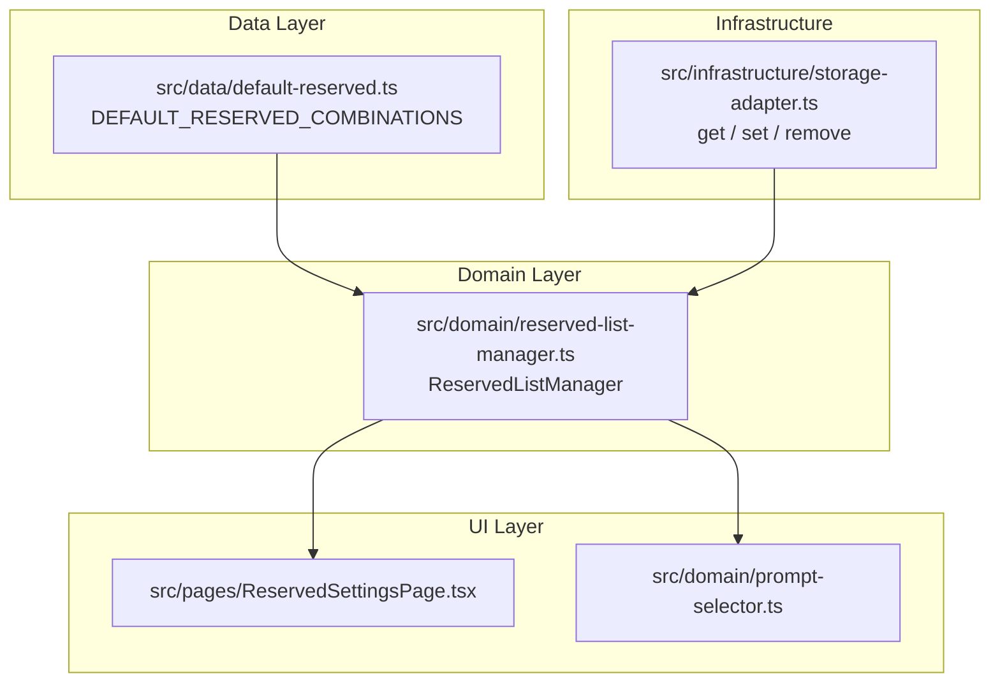

# Design Document: User-Managed Reserved Combinations

## Overview

This feature expands the application's reserved combination system from a static OS-only list to a user-customizable reserved list that also includes browser-reserved shortcuts. The core addition is a `ReservedListManager` domain module that computes an *effective* reserved list by merging a built-in default list with user overrides (additions and removals). User overrides are persisted to localStorage and the effective list is consumed by the existing prompt selector to filter exercise prompts.

The design follows the project's existing patterns:
- Domain logic lives in `src/domain/` as pure functions with storage adapter calls
- Data constants live in `src/data/`
- Infrastructure (localStorage) uses the existing `storage-adapter.ts`
- A new route/page surfaces the UI for managing the list

## Architecture



**Flow:**
1. On load, `ReservedListManager` reads overrides from localStorage via `storage-adapter`.
2. It merges overrides with `DEFAULT_RESERVED_COMBINATIONS` to produce the effective list.
3. The prompt selector calls `isReserved(combo)` from the manager instead of the old `isOsReserved()`.
4. The settings UI calls manager functions to add/remove/reset, which persist changes and recompute the effective list.

## Components and Interfaces

### 1. Data: `src/data/default-reserved.ts`

Replaces the current `src/data/os-reserved.ts` with an expanded list. The existing file will be kept for backward compatibility but its exports will delegate to the new module.

```typescript
import type { KeyCombination } from '../domain/types';

/** OS-level reserved combinations (macOS) */
export const OS_RESERVED: KeyCombination[] = [
  // Cmd+Tab, Cmd+Q, Cmd+Space, Cmd+H, Cmd+M
  // Ctrl+Up, Ctrl+Down, Ctrl+Left, Ctrl+Right
  // ... (existing list)
];

/** Browser-reserved combinations that cannot be reliably intercepted */
export const BROWSER_RESERVED: KeyCombination[] = [
  // Cmd+W, Cmd+T, Cmd+N, Cmd+L, Cmd+R
  // Cmd+Shift+T, Cmd+Shift+N, Cmd+Shift+W
];

/** Combined default reserved list */
export const DEFAULT_RESERVED_COMBINATIONS: KeyCombination[] = [
  ...OS_RESERVED,
  ...BROWSER_RESERVED,
];
```

### 2. Domain: `src/domain/reserved-list-manager.ts`

Pure domain module. Stateless functions that accept/return data.

```typescript
export interface UserOverrides {
  additions: KeyCombination[];
  removals: KeyCombination[];
}

// Core functions
export function getEffectiveList(defaults: KeyCombination[], overrides: UserOverrides): KeyCombination[];
export function isReserved(combo: KeyCombination, effectiveList: KeyCombination[]): boolean;
export function addCombination(overrides: UserOverrides, combo: KeyCombination, defaults: KeyCombination[]): UserOverrides;
export function removeCombination(overrides: UserOverrides, combo: KeyCombination, defaults: KeyCombination[]): UserOverrides;
export function resetOverrides(): UserOverrides;

// Serialization
export function serializeOverrides(overrides: UserOverrides): string;
export function deserializeOverrides(json: string): UserOverrides | null;

// Persistence wrappers
export function loadOverrides(): UserOverrides;
export function saveOverrides(overrides: UserOverrides): boolean;
export function clearOverrides(): void;
```

**Key design decisions:**

- `getEffectiveList` is a pure function: `effective = (defaults + additions) - removals`
- `addCombination` returns a new `UserOverrides` (immutable pattern) and rejects duplicates
- `removeCombination` works differently depending on whether the combo is from defaults or user-added:
  - Default combo: adds to `removals` array
  - User-added combo: removes from `additions` array
- `deserializeOverrides` returns `null` on invalid data (fail-safe)
- Combination equality uses the same deep comparison as the existing `isOsReserved`

### 3. Integration: Updated `src/domain/prompt-selector.ts`

The `filterReserved` function will be updated to use `ReservedListManager`:

```typescript
import { loadOverrides } from './reserved-list-manager';
import { getEffectiveList, isReserved } from './reserved-list-manager';
import { DEFAULT_RESERVED_COMBINATIONS } from '../data/default-reserved';

function filterReserved(prompts: KeyCombination[]): { available: KeyCombination[]; reserved: KeyCombination[] } {
  const overrides = loadOverrides();
  const effectiveList = getEffectiveList(DEFAULT_RESERVED_COMBINATIONS, overrides);
  
  const available: KeyCombination[] = [];
  const reserved: KeyCombination[] = [];
  
  for (const prompt of prompts) {
    if (isReserved(prompt, effectiveList)) {
      reserved.push(prompt);
    } else {
      available.push(prompt);
    }
  }
  
  return { available, reserved };
}
```

### 4. Backward Compatibility: Updated `src/data/os-reserved.ts`

The existing module will re-export from the new data file to avoid breaking existing imports:

```typescript
export { DEFAULT_RESERVED_COMBINATIONS as OS_RESERVED_COMBINATIONS } from './default-reserved';
export { isOsReserved } from '../domain/reserved-list-manager';
// Deprecated: use reserved-list-manager directly
```

### 5. UI: `src/pages/ReservedSettingsPage.tsx`

New page accessible at `/settings/reserved`. Features:

- Displays effective reserved list grouped by source (OS / Browser / User-added)
- Visual badge/tag distinguishing default vs. user-added entries
- Remove button on each entry (removes from effective list)
- "Add Combination" form using the existing key capture engine pattern from CustomSetsPage
- "Reset to Defaults" button with confirmation
- Count summary showing total reserved combinations

### 6. Navigation Update

Add a route in `App.tsx`:
```typescript
<Route path="/settings/reserved" element={<ReservedSettingsPage />} />
```

Add a link from the Layout or a new Settings section in the nav.

## Data Models

### UserOverrides (persisted to localStorage)

```typescript
interface UserOverrides {
  additions: KeyCombination[];  // User-added combinations not in defaults
  removals: KeyCombination[];   // Default combinations the user wants to un-reserve
}
```

**Storage key:** `mkt_reserved_overrides`

**JSON schema:**
```json
{
  "additions": [
    { "modifiers": { "ctrl": true, "alt": false, "shift": false, "meta": false }, "baseKey": "KeyW" }
  ],
  "removals": [
    { "modifiers": { "ctrl": false, "alt": false, "shift": false, "meta": true }, "baseKey": "KeyH" }
  ]
}
```

### Effective List Computation

```
effectiveList = (DEFAULT_RESERVED_COMBINATIONS ∪ overrides.additions) ∖ overrides.removals
```

Combination equality is defined by matching all four modifier booleans AND the baseKey string.

### KeyCombination (existing type, unchanged)

```typescript
interface KeyCombination {
  modifiers: ModifierSet;  // { ctrl, alt, shift, meta: boolean }
  baseKey: string;         // event.code value
}
```


## Correctness Properties

*A property is a characteristic or behavior that should hold true across all valid executions of a system — essentially, a formal statement about what the system should do. Properties serve as the bridge between human-readable specifications and machine-verifiable correctness guarantees.*

### Property 1: Add then reserved

*For any* valid KeyCombination not already in the effective reserved list, adding it via `addCombination` should result in `isReserved` returning true for that combination in the new effective list.

**Validates: Requirements 2.1**

### Property 2: Duplicate addition rejection

*For any* KeyCombination that already exists in the effective reserved list (whether from defaults or prior user additions), attempting to add it again should return the same UserOverrides unchanged.

**Validates: Requirements 2.2**

### Property 3: Remove then not reserved

*For any* KeyCombination present in the effective reserved list, removing it via `removeCombination` should result in `isReserved` returning false for that combination in the new effective list.

**Validates: Requirements 3.1**

### Property 4: Persistence round trip

*For any* valid UserOverrides object, saving it to localStorage via `saveOverrides` and then loading it back via `loadOverrides` should produce a structurally equivalent UserOverrides object.

**Validates: Requirements 4.1, 4.2**

### Property 5: Corrupted data fallback

*For any* arbitrary string stored in localStorage at the overrides key that does not conform to the UserOverrides schema, `loadOverrides` (via `deserializeOverrides`) should return empty overrides (no additions, no removals), and the resulting effective list should equal the default reserved list.

**Validates: Requirements 4.3, 7.3**

### Property 6: Reset restores defaults

*For any* UserOverrides (with arbitrary additions and removals), after calling `clearOverrides`, the loaded overrides should be empty and the effective reserved list should be exactly equal to `DEFAULT_RESERVED_COMBINATIONS`.

**Validates: Requirements 5.1, 5.2**

### Property 7: Effective list exclusion from prompts

*For all* combinations in the effective reserved list, the prompt selector should never include any of those combinations in the returned prompts array for any category and any prompt count.

**Validates: Requirements 6.3**

### Property 8: Serialization round trip

*For any* valid UserOverrides object, serializing it with `serializeOverrides` and then deserializing with `deserializeOverrides` should produce a structurally equivalent UserOverrides object.

**Validates: Requirements 7.2**

## Error Handling

| Scenario | Behavior |
|----------|----------|
| localStorage unavailable | `loadOverrides` returns `{ additions: [], removals: [] }`. Effective list equals defaults. UI shows a non-blocking warning. |
| Corrupted JSON in storage | `deserializeOverrides` returns `null`, `loadOverrides` treats as empty overrides. No crash. |
| QuotaExceededError on save | Uses existing storage-adapter retry (prune old sessions). If still fails, returns `false` and UI shows error toast. |
| Adding a duplicate combination | `addCombination` returns the unchanged overrides. UI shows a "duplicate" notice. |
| Removing a combination not in the list | `removeCombination` returns unchanged overrides (no-op). |
| Invalid KeyCombination (no modifiers, empty baseKey) | Validated at UI input layer — the key capture engine only produces valid combinations. |

## Testing Strategy

### Unit Tests (example-based)

- Default list contents: verify specific OS and browser combos are present (Requirements 1.1, 1.2)
- First-load behavior: empty overrides → effective equals defaults (Requirement 1.3)
- Serialization format shape: verify JSON has `additions` and `removals` arrays (Requirement 4.4, 7.1)
- UI rendering: default vs user-added visual distinction (Requirement 3.3)
- Edge cases: adding a combo with only modifiers (no base key), empty overrides save/load

### Property-Based Tests (fast-check, 100+ iterations each)

| Test File | Property | Tag |
|-----------|----------|-----|
| `reserved-list-add.property.test.ts` | Property 1 | Feature: user-managed-reserved-combinations, Property 1: Add then reserved |
| `reserved-list-duplicate.property.test.ts` | Property 2 | Feature: user-managed-reserved-combinations, Property 2: Duplicate addition rejection |
| `reserved-list-remove.property.test.ts` | Property 3 | Feature: user-managed-reserved-combinations, Property 3: Remove then not reserved |
| `reserved-list-persistence.property.test.ts` | Property 4 | Feature: user-managed-reserved-combinations, Property 4: Persistence round trip |
| `reserved-list-corrupted.property.test.ts` | Property 5 | Feature: user-managed-reserved-combinations, Property 5: Corrupted data fallback |
| `reserved-list-reset.property.test.ts` | Property 6 | Feature: user-managed-reserved-combinations, Property 6: Reset restores defaults |
| `reserved-list-prompt-exclusion.property.test.ts` | Property 7 | Feature: user-managed-reserved-combinations, Property 7: Effective list exclusion from prompts |
| `reserved-list-serialization.property.test.ts` | Property 8 | Feature: user-managed-reserved-combinations, Property 8: Serialization round trip |

**Library:** `fast-check` (already in devDependencies)
**Runner:** `vitest` with `jsdom` environment (for localStorage access)
**Iterations:** Minimum 100 per property (`{ numRuns: 100 }`)

### Arbitraries (generators)

Reuse the project's existing pattern from `custom-set-json.property.test.ts`:

```typescript
const keyCombinationArb = fc.record({
  modifiers: fc.record({
    ctrl: fc.boolean(),
    alt: fc.boolean(),
    shift: fc.boolean(),
    meta: fc.boolean(),
  }),
  baseKey: fc.constantFrom(...VALID_BASE_KEY_CODES),
});

const userOverridesArb = fc.record({
  additions: fc.array(keyCombinationArb, { minLength: 0, maxLength: 10 }),
  removals: fc.array(keyCombinationArb, { minLength: 0, maxLength: 10 }),
});
```

### Integration Tests

- Prompt selector integration: modify overrides in localStorage, call `getPromptsForCategory`, verify updated filtering (Requirement 6.2)
- Full add → persist → reload → verify cycle through the manager API
